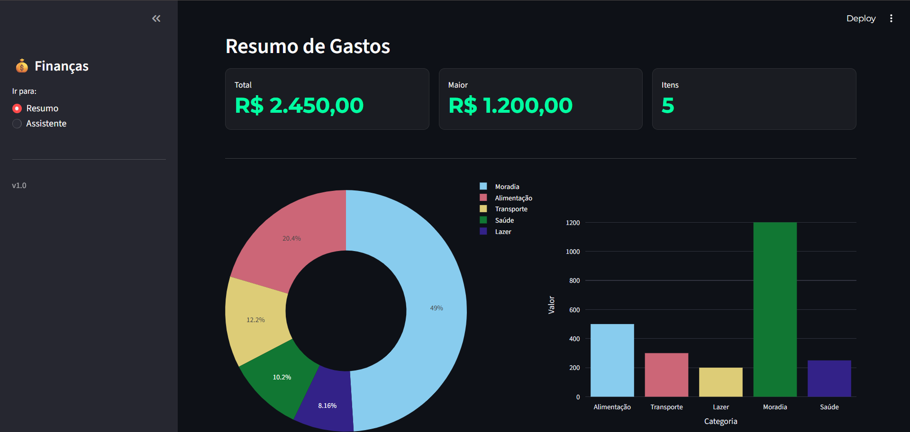

# 💰 Agente Financeiro com IA

Dashboard financeiro interativo desenvolvido com **Python + Streamlit**, com integração de um assistente de IA capaz de responder perguntas com base nos dados carregados.

---

## 📊 Visão Geral

Este projeto permite visualizar e analisar gastos de forma simples e rápida, além de interagir com um assistente que gera respostas em linguagem natural a partir dos dados.

---

## 🚀 Funcionalidades

📈 **Resumo financeiro automático**

  * Total gasto
  * Maior valor
  * Quantidade de registros

📊 **Visualização de dados**

  * Gráfico de rosca por categoria
  * Gráfico de barras

🤖 **Assistente com IA**

  * Responde perguntas sobre os dados
  * Gera insights básicos

🎨 **Interface moderna**

  * Compatível com modo claro e escuro
  * Layout responsivo

---

## 🖼️ Preview



---

## 📂 Estrutura do Projeto

```id="y3x4o6"
.
├── src/
│   ├── app.py
│   └── llm_agent.py
├── dados_exemplo.csv
├── requirements.txt
└── README.md
```

---

## 📄 Formato dos Dados

O arquivo `dados_exemplo.csv` deve conter duas colunas:

| Categoria   | Valor    |
| ----------- | -------- |
| Alimentação | R$ 50,00 |
| Transporte  | R$ 30,00 |

O sistema realiza automaticamente a limpeza e conversão dos valores.

---

## ⚙️ Como Executar

### 1. Clonar o repositório

```bash id="v1e0h2"
git clone https://github.com/luciana-gouveia/agente-financeiro-ia.git
cd agente-financeiro-ia
```

### 2. Instalar dependências

```bash id="2m1z9w"
pip install -r requirements.txt
```

### 3. Executar o projeto

```bash id="w8p4k1"
streamlit run src/app.py
```

---

## 🤖 Assistente de IA

O projeto utiliza um módulo (`llm_agent.py`) responsável por gerar respostas com base no contexto dos dados.

Exemplo de uso:

```id="k9l2d7"
Pergunta: Qual categoria tem maior gasto?
Resposta: Alimentação representa a maior parte dos gastos.
```

---

## ⚠️ Observações

* O arquivo `dados_exemplo.csv` deve estar na raiz do projeto
* Caso não seja encontrado, o sistema tentará buscar em um nível acima
* Certifique-se de que os dados estejam no formato correto

---

## 🛠 Tecnologias Utilizadas

* Python
* Streamlit
* Pandas
* Plotly

---

## 📌 Versão

**v1.0**

---

## 📄 Licença

Projeto para fins de estudo e demonstração.
